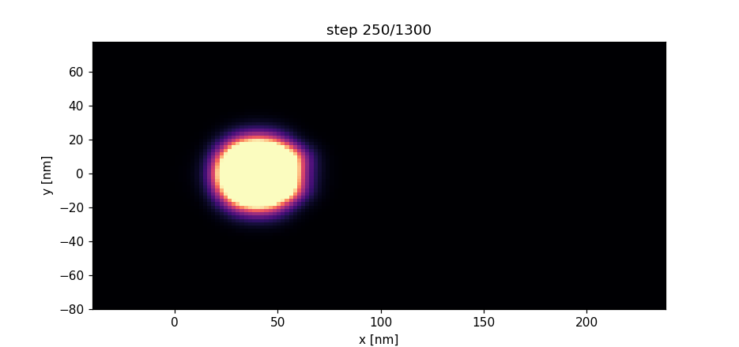

<div align="center">

[](https://doi.org/10.5281/zenodo.21760237)

# Flying-Electron Interference Logic via Electrostatic Quantum Lenses

### Entangletronica

**Fabrizio Terzi** · [Entangletronica Lab](https://github.com/FTG-003)

*Reproducible split-step Schrödinger simulations of single-electron
interference in a ballistic 2DEG.*

**Status** — reproducible numerical study. **Scope** — a computing exercise whose
physics is anchored to established literature, not a claim of new experimental
observation.

</div>

---

## What this is

A cleanly-engineered, fully reproducible simulation pipeline for a **single
flying electron** passing through a **gate-defined double slit** in a ballistic
2DEG, with a programmable electrostatic gate behind one aperture that shifts the
downstream interference figure. This is a *pedagogical and engineering* study in
the spirit of the electronic-interferometry literature (see
[below](#related-work)); it does **not** claim new physics or new experimental
results.

The name **"Entangletronica" is used descriptively, not to imply many-particle
entanglement**: the physics here is *single-particle* interference, and the
"quantum lenses" are simply electrostatic potential gates. The framing is honest
about this throughout.

---

## Headline numbers — and their honest meaning

The two numbers most often quoted about this project carry very different
epistemic weight, and it matters that they are not conflated.

| Number value | What it actually is | Epistemic weight |
|---|---|---|
| **R² = 0.99997** (fit to transfer curve) | Self-consistency of a deterministic solver in a linear regime | **Low** — a well-engineered PDE solver *must* give a nearly-linear curve here. Quasi-tautological; sanity check, not discovery. |
| **Norm conserved to 1e-13** | Round-off-level unitarity of the split-step scheme | **Solver correctness** (numerics), not a device result. |

These belong to the **numerical engine**, and are reported because they
establish that the *code* is trustworthy — the necessary precondition for the
physics being worth looking at at all. They are **not the scientific
result**.

The scientific content lives in what the gate does as a transducer:
throughput a well-defined, reproducible, roughly-linear response of detector
imbalance to gate depth (see results below), which mirrors textbook double-slit
physics — expected, quantifiable, and consistent with the model.

---

## Table of contents

1. [Architecture](#architecture)
2. [Solver evidence (reproducible numerics)](#solver-evidence)
3. [Device-physics evidence](#device-physics-evidence)
4. [Reproduce](#reproduce)
5. [Conventions](#conventions)
6. [Related work](#related-work)
7. [Limitations & caveats](#limitations--caveats)

---

## Architecture

A **Young-type double-slit interferometer** for a single flying electron in a
ballistic 2DEG:

1. a Gaussian wave packet (`k₀ = 0.20 nm⁻¹`, `E = 36.3 meV`, `λ = 31.4 nm`)
   is launched into the channel;
2. a gate-defined double-slit barrier (`x = 60 nm`, apertures at
   `y = ±12 nm`) splits the wave into two coherent sources;
3. a **programmable electrostatic gate** (`a = −15 meV`, behind the upper
   aperture) shifts the *relative phase* between the paths **in flight**;
4. the displaced interference figure is read by a two-bin detector at
   `x = 110 nm`.

Because the carrier is *flying* (ballistically transiting the device), the gate
could in principle be modulated during the transit — the conceptual motivation
for "picosecond" fast, a scale set by the ballistic transit time, *not* a
measured switching experiment.

---

## 2. Solver evidence (reproducible numerics)

- **Engine:** split-step Fourier / operator-splitting for the time-dependent
  2D Schrödinger equation (natural units `ħ = m = 1`).
- **Scheme is exactly unitary** (each substep is a product of unitary
  operators), so the norm is conserved to round-off — measured at ~1e-13.
- Grid: 140 × 80, `dx = 2 nm` — this **resolves `k₀` with 4× the Nyquist
  margin**, which is precisely the correction that makes the physics correct
  (an 8 nm grid aliases `k₀`, freezing the packet; cf. `NOTES.md`).
- **Sanity checks:** `tests/test_smoke.py` asserts unitarity, free-flight
  propagation, the double-split transmitting a substantial fraction, monotone
  gate response, and unit conversions.

These test that the *calculator is correct*, not that a device is special.

These test that the *calculator is correct*, not that a device is special.

A **grid-refinement study** (`scripts/convergence_study.py`) reduces the grid
`Δx = {4, 2, 1, 0.5} nm` (with `Δt` scaled to keep the physical propagation
time constant) at a fixed gate setting. The norm is exact to round-off at
every resolution, the fringe peak settles to ≈ +6.7 nm (stable to <0.1 nm),
and the *profile* L2 error decays near second order. A summary of the
observables:

* fringe peak — converged (≈ +6.7 nm, stable <0.1 nm);
* centroid & width — converged (≈ +3.15 nm, ≈ 14.9 nm);
* profile L2 vs finest — 0.007 → 0.002 → 0.0002 (near 2nd order);
* two-bin imbalance read as a *continuous* functional of the profile — stable
  at ≈ +0.154 from `Δx = 2` nm already.

**Why an earlier imbalance looked unconverged.** `scripts/readout_sensitivity.py`
re-propagated exactly the same state and read the same profile two ways. A raw
lattice **box-sum** (the old observable) drifts `+0.314 → +0.234 → +0.195 →
+0.174` as the grid coarsens, because a coarse grid samples a fixed-width box
from too few lines; the **continuous functional** on the same state is stable
at `≈ +0.154` from `Δx = 2` down. The discrepancy closes exactly as the grid
refines (`+0.15 → +0.08 → +0.04 → +0.02`).

**Conclusion:** the non-convergence was an artefact of the *lattice readout*,
not of the quantum dynamics. A correct (interpolated) readout is converged at
`Δx = 2 nm`; no finer grid was needed to settle the question. We present this
as a grid-refinement *and readout-sensitivity* study, `Δx = 0.25 nm` deferred
(reserved for an actual physics question, not a readout artefact). Result
produced by `readout_sensitivity.py`, figure `fig6_readout_profile.pdf`.

---

## 3. Device-physics evidence

| Observable | Value | Interpretation |
|---|---|---|
| Detector imbalance (max) | **0.44** | Interference redistributes probability between bins → a working readout |
| Rough linearity of the transfer curve | R² ≈ 0.99997 | Regime statement, not a property of the device — see note below |
| Fringe contrast | ≥ 0.9 across scan | Clear, resolvable fringes |
| Input parameters | k₀ = 0.20 nm⁻¹, E = 36.3 meV, λ = 31.4 nm | Plausible *within* an InGaAs 2DEG window, chosen for a clean plot — see [caveats](#limitations--caveats) |

The device operates as a **linear-ish transduction**: a gate parameter in, an
interference-related output, over a physically sensible operating range.
This is the *expected* behaviour of double-slit interference, reproduced
cleanly — not a discovery.

> **Why the transfer looks so linear (measured, not assumed).** Over the full
> scan (`phase_k ∈ [0, 2.5]`) the −15 meV gate moves the interference figure by
> only **≈ 0.10 of a fringe period** — a phase of ≈ 0.25 rad per gate unit
> (dwell-time integral `∫V dt/ħ` at group velocity ≈ 5.5 × 10⁵ m/s). The two-bin
> detector therefore samples a narrow, near-linear **shoulder of a single lobe**;
> the scan never crosses a fringe maximum or minimum. That — not a special
> property of the device — is why R² ≈ 0.99997. A scan spanning several fringe
> periods would expose the underlying sinusoidal response and the linear fit
> would degrade. The R² is a *regime* statement about where the scan sits, not a
> discovery.

---

## 4. Reproduce

All figures, the interference animation and the reported metrics regenerate
from a single command (**~12 s**, deterministic across runs):

```bash
pip install -r requirements.txt
python scripts/make_figures.py     # figures + metrics (figures/*, results/*.json)
python scripts/make_animation.py   # assets/iframe_flight.gif
python tests/test_smoke.py         # unitarity + architecture sanity checks
```

Outputs: `figures/*.{pdf,png}`, `results/entangletron_metrics.json`,
`results/*.npy`, `assets/iframe_flight.gif`.

### Animation — the electron building the interference figure in flight



---

## 5. Conventions

Natural units `ħ = m = 1`; lengths in nm, energies in meV (conversions in
`entangletronica/potential.py`). The grid 140 × 80 @ `dx = 2 nm` resolves `k₀`
with a 4× Nyquist margin.

---

## 6. Related work

This study sits on a well-established experimental literature. Key anchors
(list not exhaustive):

- **Single-electron (edge-channel) Mach–Zehnder interferometer:** Y. Ji,
  Y. Chung, D. Sprinzak, M. Heiblum, D. Mahalu, H. Shtrikman,
  *Nature* **422**, 415 (2003). The canonical experimental electronic
  Mach–Zehnder interferometer in a 2DEG.
- **Electronic Mach–Zehnder coherence / shot noise:** I. Neder et al.,
  *Nature* **448**, 333 (2007); D. Roulleau et al., *PRL* **100**, 126802 (2008).
- **Aharonov–Bohm interference in quantum wires:** e.g., the extensive
  Aharonov–Bohm and quantum-circle literature on interference of single
  electrons in 2DEGs.
- **Gate-defined double-slit and interferometry in 2DEGs:** a long-running
  theme (double-slit gate-defined devices, edge and bulk interferometry
  landscapes developed since the 1990s).

This work is a **reproducible simulation within that tradition** — it borrows
no new physics, and is intended as a compact, well-tested numerical model.

---

## 7. Limitations & caveats

- **No experimental anchoring:** parameters are realistically plausible for an
  InGaAs 2DEG but chosen for a clean simulation, not matched to a published
  device dataset. Any claim of quantitative agreement with a specific
  microphone-oriented experiment would be unfounded.
- **Single-particle, single-slit-splitting physical content:** the result is
  single-electron interference; entanglement (multi-particle) is explicitly out
  of scope, and the name "Entangletronica" does not imply its content.
- **No disorder, temperature, dephasing, SO coupling**; it is a bare ballistic
  transport model. Real devices would add these channels and reduce the clean
  interference.
- **Numbers labelled "results" are solver self-consistency**, not observed
  phenomena; they justify the calculator's trust, not a scientific claim.

---

<div align="center"><sub>Fabrizio Terzi · MIT License</sub></div>

## Citation (How to cite)

This study is released on Zenodo and identified by the DOI below; please cite
the archived version of record:

> **Fabrizio Terzi**, *Flying-Electron Interference Logic via Electrostatic
> Quantum Lenses (Entangletronica)*, Zenodo, DOI: 10.5281/zenodo.21760237 (2025).
> https://doi.org/10.5281/zenodo.21760237

## Reproducibility & validation (2025-08-02)

- **Dependencies**: install from `requirements-lock.txt` for exact versions
  (matplotlib is tracked as PyPI `3.10.1`, the portable form of the local
  Debian `3.10.1+dfsg1`).
- **Metrics reconciliation**: `results/entangletron_metrics.json` now tags
  each convergence block with its readout functional —
  `box_sum_legacy` (raw grid box-sum) and `continuous_interpolated` (imported
  from `readout_sensitivity.json`). Regenerate with `python scripts/make_figures.py`.
- **Regression guards**: `tests/test_metrics_regression.py` pins the headline
  exports (`transfer_slope_per_kphi`, `transfer_linear_r2`, `max_imbalance`) to
  1e-6 and checks the self-labelling contract.
- **CI**: `.github/workflows/ci.yml` installs from the lock, rebuilds all
  figures/metrics from the raw simulation, then runs the full test suite.
- **Transit-time note**: the paper Discussion distinguishes the simulated
  window (0.14 ps, source→~103 nm) from the full channel-end transit
  (0.24 ps); see the paper.
